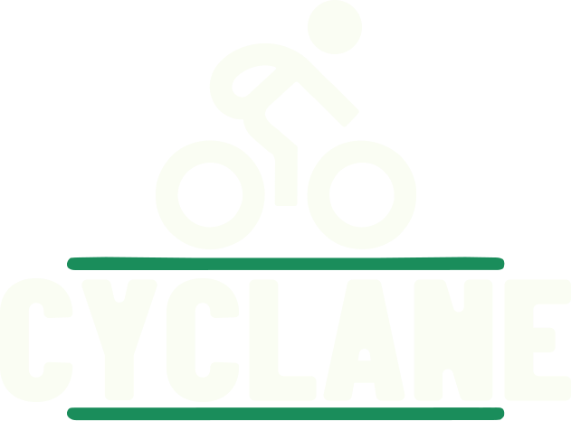

<div align="center">
  
  
  *Application mobile pour promouvoir la mobilité douce à Bordeaux*
  
  
  
</div>

## À propos du projet

**Cyclane** est une application mobile développée pour encourager l'usage du vélo dans la métropole bordelaise. L'application offre des outils de navigation intelligents, de planification d'itinéraires et de localisation de services cyclables pour promouvoir une mobilité urbaine durable.

### Problématiques adressées

- **Congestion urbaine** : Réduction du trafic automobile
- **Impact environnemental** : Diminution de la pollution atmosphérique  
- **Mobilité urbaine** : Alternative aux difficultés de stationnement en centre-ville

### Fonctionnalités principales

-  **Cartographie interactive** avec pistes cyclables intégrées
-  **Planification d'itinéraires** optimisés pour cyclistes
-  **Géolocalisation** des vélos en libre-service
-  **Navigation temps réel** adaptée aux infrastructures cyclables
-  **Suivi personnel** des trajets et statistiques
-  **Interface moderne** avec design system cohérent

##  Stack technique

### Core Framework
```json
{
  "react-native": "0.81.4",
  "expo": "~54.0.10",
  "react": "19.1.0",
  "typescript": "~5.9.2"
}
```

### Bibliothèques principales

| Domaine | Technologie | Version | Usage |
|---------|-------------|---------|-------|
| **Maps & Navigation** | `react-native-maps` | 1.20.1 | Cartographie interactive |
| **Graphics** | `react-native-svg` | ^15.13.0 | Graphiques vectoriels |
| **UI/UX** | `expo-linear-gradient` | ^15.0.7 | Dégradés d'interface |
| **Typography** | `expo-font` | ^14.0.8 | Polices personnalisées |

### Outils de développement
- **Expo CLI** - Environnement de développement intégré
- **TypeScript** - Typage statique et IntelliSense
- **Metro Bundler** - Bundler JavaScript pour React Native

##  Design System

### Palette chromatique
```css
:root {
  --primary: #1A8D5B;      /* Vert nature */
  --background: #FAFDF3;    /* Blanc cassé naturel */
  --accent-pink: #FDEDFD;   /* Rose pastel */
  --accent-yellow: #FEF7C2; /* Jaune doux */
}
```

##  Installation & Usage

### Prérequis système
- **Node.js** ≥ 18.0.0
- **npm** ou **yarn**
- **Expo CLI** (global)
- **Smartphone** avec Expo Go (développement)

### Setup du projet
```bash
# Clone du repository
git clone git@github.com:B3ANQ/Cyclane.git
cd SmartCity/SmartCity

# Installation des dépendances
npm install

# Démarrage du serveur de développement
npm start
```

### Scripts disponibles
```bash
npm start          # Démarre Metro Bundler
npm run android    # Build Android
npm run ios        # Build iOS  
npm run web        # Version web
```

##  Équipe de développement

| Rôle | Membre |
|------|---------|
| **UI/UX Designer** | Téo Jamin |
| **Product Owner** | Thom Legros |
| **Full Stack Developer** | Loan Lucmau |
| **Full Stack Developer** | Victor Sanson |

##  Impact & Objectifs

### Métriques ciblées
-  **Réduction CO₂**
-  **Adoption cycliste**
-  **Trafic automobile**

### Public cible
- **Professionnels** en déplacement métropolitain
- **Étudiants** et jeunes actifs (18-35 ans)
- **Résidents** de Bordeaux Métropole

##  Licence

Ce projet est développé dans le cadre académique d'Epitech Digital School.

---

<div align="center">
  <strong>SmartCity - Pour une mobilité plus verte à Bordeaux</strong>
  
  [Documentation](docs/) • [Issues](issues/) • [Releases](releases/)
</div>
